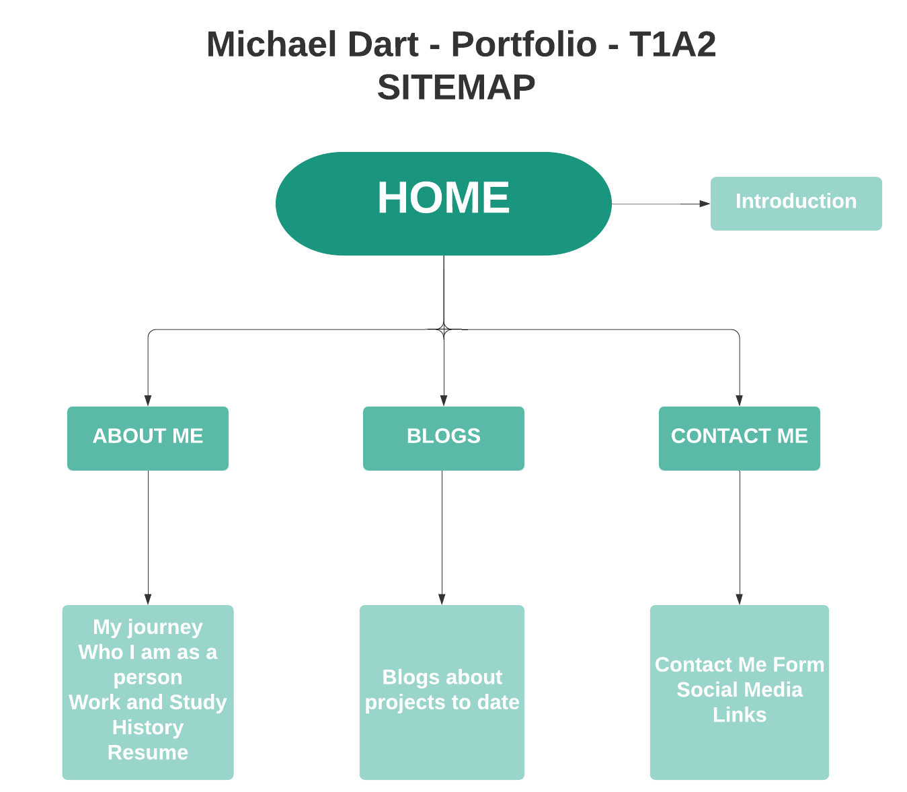
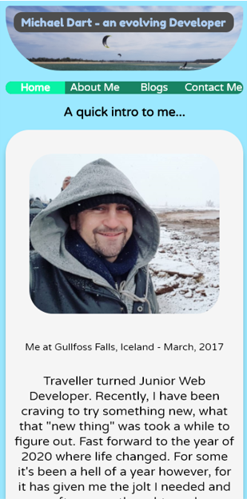
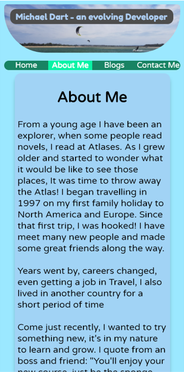
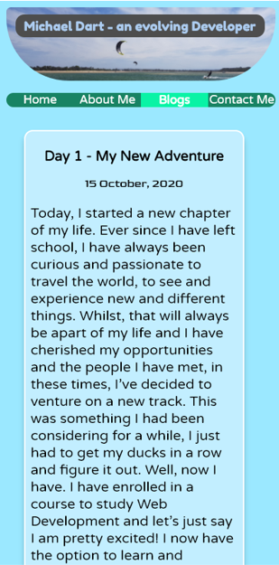
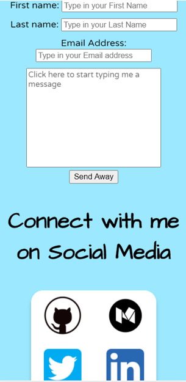
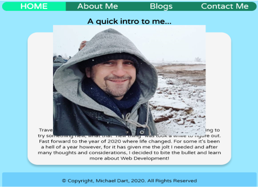
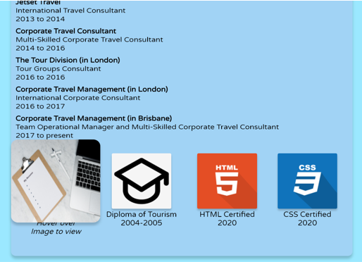
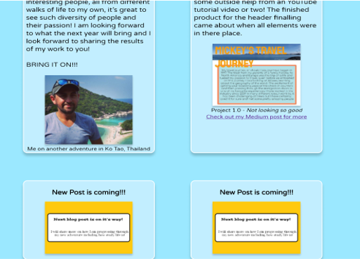
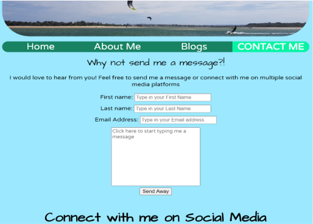

# **MICHAEL DART - T1A2 - PORTFOLIO ASSIGNMENT**
## **Target Audience**
Seeking the attention of industry leaders who are looking for a junior web developer with rich life experience who is eager to learn and develop and in due time progress past an entry-level of employment. I am also wanting to connect with other industry professionals to collaborate on ideas and work together on projects.
<br>
<br>

## **About the Website**
### **Purpose**
The website is a comprehensive insight into myself and who I am as a person. Showcasing my work and study history, what got me into coding and my coding journey so far with the projects I have embarked on so far.
<br>
<br>

### **Functionality and Features**
As a portfolio website, the functionality is simple with 4 pages that share a uniformed layout<br>
The uniformed and simple layout includes:
- Header
- Navigation Bar
- Body (for the content)
- Footer
<br>
<br>

*Features of the website include:*
#### **SUBRESOURCE INTEGRITY**
To ensure the security of the website and the audience, Subresource Integrity (or SRI) is coded into all pages. Giving the audience confidence that any resources they access aren't manipulated by a malicious person.
<br>
<br>

#### **THE HEADER**
The header features a title sitting infront of an image to form the identity of the website. A fade-in animation is a set to these elements for a "WOW" effect when the audience enters/refreshes the page, additional coding allows the styling to be viewed across multiple browsers. The title and image are finished off with curved edges for a calm feel.
<br>
<br>

**Example code HTML Code:**
``` html
    <div class="header">
        <header>
            
            <div class="title">Michael Dart - an evolving Developer</div>
        </header>
    </div>
```
<br>
<br>

**Example code CSS Code:**
``` css 
.header {
    position: relative;
}

.header img {
    border-radius: 5px 5px 70px 70px;
    max-width: 100%;
    animation: fadeIn ease 3.5s;
    -webkit-animation: fadeIn ease 3.5s;
    -moz-animation: fadeIn ease 3.5s;
    -o-animation: fadeIn ease 3.5s;
    -ms-animation: fadeIn ease 3.5s;
}

.title {
    position: absolute;
    display: inline-block;
    top: 8px;
    left: 10px;
    color: rgb(172, 204, 240);
    font-size: 2.3vh;
    font-family: 'Fredoka One', cursive;
    background-color: rgb(77, 77, 77);
    border-radius: 10px;
    padding: 4px 10px 4px 10px;
    animation: fadeIn ease 3s;
    -webkit-animation: fadeIn ease 3.5s;
    -moz-animation: fadeIn ease 3.5s;
    -o-animation: fadeIn ease 3.5s;
    -ms-animation: fadeIn ease 3.5s; 
```
<br>
<br>

#### **THE NAVIGATION BAR**
A single line bar with 4 titles that shrinks in smaller screen sizes. This navigation bar is easy to see across all devices allowing the audience to connect seemlessly to any page of the website. For easy reference, the active (or current) page is highlighted in a different colour with bold and uppercase text.
<br>
<br>

**Example code HTML Code:**
``` html
    <div class="navbar">
        <nav>
            <ul>
                <li><a class="active" href="#">Home</a></li>
                <li><a href="aboutme.html">About Me</a></li>
                <li><a href="blogs.html">Blogs</a></li>
                <li><a href="contactme.html">Contact Me</a></li>
            </ul>
        </nav>
    </div>
```
<br>
<br>

**Example code CSS Code:**
``` css
.navbar {
    border-radius: 15px;
    margin-top: 10px;
    margin-bottom: 5px;
    background-color: rgb(24, 131, 99);
    width: 100%;
    overflow: auto;
}

ul {
    list-style-type: none;
    margin: 0;
    padding: 0;
}

.navbar li {
    font-size: 2.10vh;
    font-weight: 400;
    font-family: 'Varela Round', sans-serif;
}

.navbar li a {
    float: left;
    color: white;
    text-decoration: none;
    text-align: center;
    width: 25%;
}

li a:hover {
    background-color: rgb(9, 243, 165);
}

.active {
    background-color: rgb(9, 243, 165);
    font-weight: 700;
}
```
<br>
<br>

#### **THE FOOTER**
Shown across all pages, the footer includes the copyright information of the website protecting the my content. Longer pages will include a "Back to top" link and on pages where image content was externally sourced, a credit to the creator has been added to keep in-line with ethical standards, giving confidence to the audience to know the website is authentic and ethical.
<br>
<br>

**Example HTML Code for Credits:**
``` html
     <div class="creditsinfo">
        <h4>Image Credits</h4>
        <p><strong>Resume Picture - </strong><span><em>Photo by <a href="https://unsplash.com/@markuswinkler?utm_source=unsplash&amp;utm_medium=referral&amp;utm_content=creditCopyText" target="_blank">Markus Winkler</a> on <a href="https://unsplash.com/?utm_source=unsplash&amp;utm_medium=referral&amp;utm_content=creditCopyText" target="_blank">Unsplash</a></em></span></p>
        <p><strong>College Hat Picture - </strong><span><em>Photo by <a href="https://www.iconfinder.com/buninux" target="_blank">Dmitriy Bunin</a> on <a href="https://www.iconfinder.com/" target="_blank">Iconfinder</a></em></span></p>
        <p><strong>HTML Logo - </strong><span><em>Photo by <a href="https://www.iconfinder.com/iconsets/long-shadow-web-icons" target="_blank">the more</a> on <a href="https://www.iconfinder.com/" target="_blank">Iconfinder</a></em></span></p>
        <p><strong>CSS Logo - </strong><span><em>Photo by <a href="https://www.iconfinder.com/iconsets/long-shadow-web-icons" target="_blank">the more</a> on <a href="https://www.iconfinder.com/" target="_blank">Iconfinder</a></em></span></p>
    </div>
```
<br>
<br>

#### **THE FORM**
Developed to enable the audience to connect with me, it features first and last name fields, an email address field and a text area for a message. Each field is highlighted when the audience hovers over it and is complete with placeholder text in each field to guide the audience to these fields, disappearing once typed in to. A send button allows the message to be sent direct to my email.
<br>
<br>

**Example HTML Code:**
``` html
   <div class="form">
        <form action=”mailto:mdart86@hotmail.com”>
            <div class="fname">
                <label class="fname" for="fname">First name:</label>
                <input placeholder="Type in your First Name" type="text" id="fname" name="fname" size="25">
            </div>
            <div class="lname">
                <label for="lname">Last name:</label>
                <input placeholder="Type in your Last Name" type="text" id="lname" name="lname" size="25">
            </div>
            <div class="email">
                <label for="email">Email Address:</label>
                <input placeholder="Type in your Email address" type="email" id="email" name="email" size="25">
            </div>
            <div class="textarea">
                <label for="textarea"></label>
                <textarea id="textarea" placeholder="Click here to start typing me a message" name="message" rows="10" cols="35"></textarea>
            </div>
            <div class="submit">
                <input id="submit" type="submit" value="Send Away">
            </div>
        </form>
    </div>
```
<br>
<br>

**Example CSS Code:** 
``` css
.form {
    display: flex;
    flex-direction: column;
    text-align: center;
    font-family: 'Varela Round', sans-serif;
    font-size: 2.5vh;
}

.fname, .lname, .email {
    margin-bottom: 10px;
}

textarea {
    margin-bottom: 5px;
}

#textarea {
    font-family: 'Varela Round', sans-serif;
    resize: none;
}

#fname:hover {
    border: solid 2px rgb(24, 131, 99);
}

#lname:hover {
    border: solid 2px rgb(24, 131, 99);
}

#email:hover {
    border: solid 2px rgb(24, 131, 99);
}

#textarea:hover {
    border: solid 2px rgb(24, 131, 99);
}

#submit:hover {
    background-color:  rgb(111, 207, 252);
}
```
<br>
<br>

#### **RESPONSIVENESS**
Whilst there are many other features, the final feature to be highlighted is the website's responsivenes. CSS Grid and CSS Flexbox properties are used in multiple areas of the website. For the below example, I will draw your attention to my Social Media Logo box on the Contact Me page. The flexbox properties allows the images to wrap into a row direction or flex into a column on smaller screens depending on the screens size.
<br>
<br>

**Example HTML Code:** 
``` html
  <div class="social-media-box">
        <div class="social-media-image">
            <a href="https://github.com/mdart86" target="_blank">
                
            </a>
        </div>
        <div class="social-media-image">
            <a href="https://michaeldart12.medium.com/" target="_blank">
                
            </a>
        </div>
        <div class="social-media-image">
            <a href="https://twitter.com/MichaelDart12" target="_blank">
                
            </a>
        </div>
        <div class="social-media-image">
            <a href="https://www.linkedin.com/in/michael-dart-537a3b57/" target="_blank">
                
            </a>
        </div>
    </div>
```
<br>
<br>

**Example CSS Code:** 
``` css
  .social-media-box {
        display: flex;    
        flex-wrap: wrap;
        width: 70%;
        height: auto;
        background-color: white;
        border-radius: 20px;
        margin: 0 auto;
        box-shadow: 0 6px 6px 0 rgba(0, 0, 0, 0.2);
    }

    .social-media-image {
        flex-direction: column;
        height: auto;
        padding: 10px;
        margin: 0 auto;
        justify-self: center;
        /* border: solid 10px black */
    }

    .social-media-image:hover {
        background-color: rgb(155, 232, 255);
        border-radius: 20px;
    }

    .social-media-box img {
        width: 64px;
    }
```
<br>
<br>

## **SITEMAP**
In the below site map, the simple structure of the website is shown. Consisting of four pages with a basic overview of what is included on each page. As indicated by the Sitemap, you can access any page from the active (current) page that the audience is on.

<br>
<br>

## **SCREENSHOTS**
These screenshots will show the website's responsiveness across multiple devices. The whole screen may not be visible on some screenshots however as the website follows a uniformed layout, the screenshots are easily followed. Leading through from mobile, to tablet and desktop views, some screenshots are will be more relative to their viewport to demonstrate the responsiveness of the website with most content shown mobile and tablet screenshots.
<br>
<br>

## **Mobile Screenshots**




<br>
<br>

## **Tablet Screenshots**




<br>
<br>

## **Desktop Screenshots**


<br>
<br>

## **TECH STACK**
Below is a list of tools I used to develop the website and it's content:
- [Balsamiq](https://balsamiq.com/) - for Wireframes/Mock-ups
- [Ubuntu](https://ubuntu.com/) - for folder navigation, changes etc and for Git version control
- [Git](https://git-scm.com/) - within Ubuntu, Git was used the version control system used
- [Visual Studio Code](https://code.visualstudio.com/) - as the platform for coding
- [HTML](https://whatwg.org/) - for the website's content
- [CSS](https://www.w3.org/) - for the website's styling
- [GitHub](https://github.com/) - for remote repository
- [Netlify](https://www.netlify.com/) - for deploying
- [Microsoft Powerpoint](https://www.microsoft.com/en-au/microsoft-365/powerpoint) - for creating the Slidedeck presentation
- [Adobe Acrobat PDF](https://www.adobe.com/au/) - for generating the official public Slidedeck presentation
- [Lucidchart](https://www.lucidchart.com/pages/) - for the Sitemap image
<br>
As mentioned previously, images that were externally sourced are have been referenced back to the creator in the footer of the pages where these images exist to keep inline with ethical standards. Other images featured on the website were either created or captured by myself.
<br>
<br>

## **REMOTE CONNECTIONS**
### Netlify 
You can access my website via [My Netlify Deployment](https://optimistic-heisenberg-5c7818.netlify.app)
<br>
<br>

### Git Hub
To see my remote respository - please go to [My GitHub Repository](https://github.com/mdart86/Michael-Dart_T1A2)
<br>
<br>

## ***I hope you enjoy my website!***